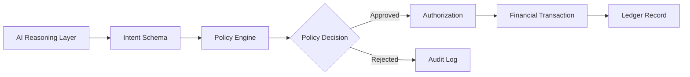

# Bo Aina

  
  

**Senior Solution Engineer · Oracle**  

Enterprise financial systems architect building AI workflow prototypes for regulated environments.

I focus on a simple problem: **how AI can help before money moves, while policy, authorization, and auditability stay deterministic.**

---

## What I Build

I build prototypes around:

- AI-assisted spend and procurement workflows
    
- policy-driven authorization patterns
    
- audit-ready decision artifacts
    
- ERP-connected financial automation for regulated environments
    

My core architecture pattern is:

**AI reasoning → policy enforcement → authorization → general ledger**

---

## Why This Matters

In many enterprise finance workflows, control happens **after** the transaction:

someone spends → the expense lands → approvals happen → the ledger records it

Modern spend systems move control **upstream**.

The important question becomes:

**Should this transaction have happened at all?**

That is where I focus: combining AI interpretation with deterministic financial controls.

---

## Featured Architecture

AI helps interpret the request. The deterministic layer decides, authorizes, and records.

---

## Featured Prototypes

### [AI Spend Governance Control Plane](https://github.com/BoAina/ai-spend-governance-control-plane)

Prototype showing how AI classification and deterministic policy enforcement can work together in procurement and spend authorization workflows.

**What it demonstrates**

- AI-assisted spend classification
    
- policy checks before approval
    
- audit-ready decision artifacts
    
- mock ERP writeback on approval
    
- regulated scenarios including grant-funded purchasing
    

**Use cases**

- corporate procurement approval
    
- grant expense authorization
    
- healthcare purchasing controls
    
- public-sector compliance workflows
    

> A prototype for pre-spend controls: AI interprets the request, policy decides, and the system records the outcome.

---

### [Deterministic AI Control Plane](https://github.com/BoAina/deterministic-ai-control-plane)

A more general control-plane pattern for constraining AI behavior through deterministic rules wherever probabilistic outputs need policy boundaries.

**What it demonstrates**

- intent extraction
    
- policy evaluation
    
- approval / rejection routing
    
- replayable decision artifacts
    
- ledger-backed auditability
    

> A generalized pattern for governed AI systems operating in regulated environments.

---

## What I Bring

- Enterprise financial systems experience across Oracle, Workday, and Tyler Technologies
    
- Experience in healthcare, grants, and regulated accounting environments
    
- Ability to translate business workflows into architecture, controls, and demo narratives
    
- Hands-on prototype building with Python, APIs, and structured AI workflows
    
- Building toward AI governance, financial infrastructure, and real-time authorization
    

---

---

## Background

I work in enterprise financial systems and have spent much of my career around controls, approvals, grants, and systems of record.

That background shapes how I think about AI.

An intelligence layer that improves how decisions are interpreted before deterministic systems authorize and record them.

---

## Current Focus

- AI-assisted financial workflows
    
- pre-spend authorization patterns
    
- policy-driven automation
    
- control-plane design for enterprise AI
    
- regulated AI deployment in finance and public-sector contexts
    

---

## Connect

- [LinkedIn](https://www.linkedin.com/in/boaina)
    
- [Aina Labs](https://ainalabs.ai/)
    
- [GitHub Projects](https://github.com/BoAina)
    

---

_The next generation of AI systems will not just generate answers - they will operate inside governed financial infrastructure._