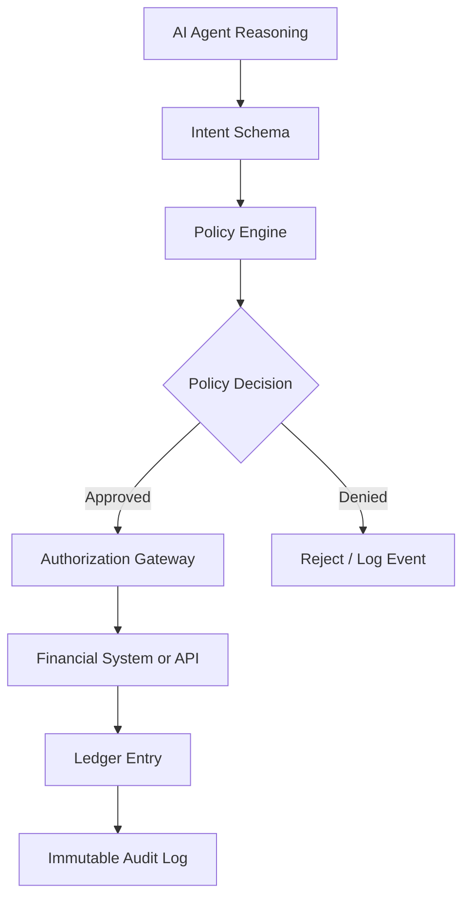
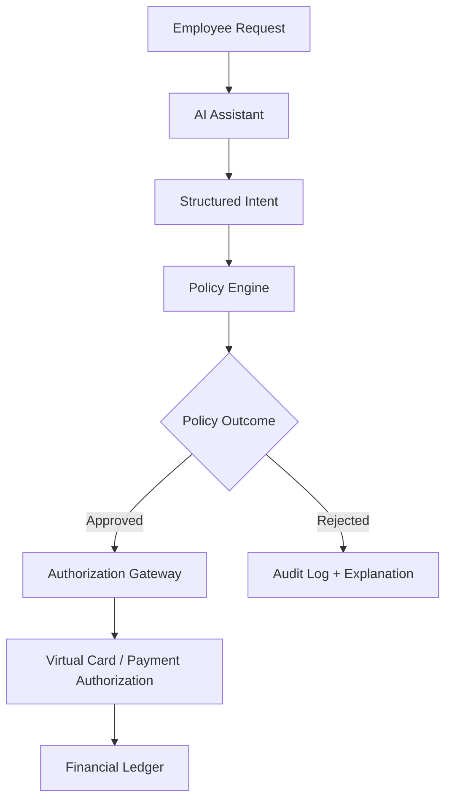

# Bo Aina

**Senior Solution Engineer · Oracle**
Financial systems architect. AI governance practitioner. Builder of deterministic control planes for regulated environments.

---

## Core Thesis

AI systems are probabilistic.
Financial infrastructure is deterministic.

Therefore AI must terminate into a deterministic control plane.

The movement of money cannot be governed by confidence intervals.
It requires rules, audit trails, and repeatable decisions.
That is the architectural problem I think about.

---

## Architecture Pattern

**AI reasons. Policy decides. Authorization executes. Ledger records.**

This pattern holds whether the domain is corporate spend, grants management, procurement, or healthcare financial workflows. The AI layer interprets and classifies. The deterministic layer decides and records.

---

## Deterministic Boundary

The boundary between probabilistic and deterministic is not a limitation.
It is an architectural feature. The AI does not need to authorize.
It needs to be right about what the request actually is.
The policy engine handles the rest.

---

## Projects

### [AI Spend Governance Control Plane](https://github.com/BoAina/ai-spend-governance-control-plane)

Prototype showing how AI classification and deterministic policy enforcement work together in procurement and spend authorization workflows.

- AI-assisted spend classification
- Deterministic policy gate with grant and procurement rules
- Audit-ready decision artifacts
- Mock ERP writeback on approval
- Public sector scenarios including federal grant allowability (2 CFR 200)

> Procurement authorization prototype, AI-assisted classification, deterministic spend controls, and audit-ready decisions for grant-funded and regulated environments.

---

### [Deterministic AI Control Plane](https://github.com/BoAina/deterministic-ai-control-plane)

The generalized pattern behind the spend governance prototype. A control plane architecture for constraining AI agent behavior through deterministic rules - applicable wherever probabilistic outputs must be bounded by policy.

- Structured intent schemas
- Policy evaluation layer
- Replayable decision artifacts
- Deterministic approval flows
- Ledger-backed auditability

> AI interprets. Rules constrain. Policy gates. Action proceeds.

---

## Financial Infrastructure Perspective

Enterprise finance typically follows a familiar sequence: someone spends, the transaction lands, approvals happen, and the ledger absorbs the truth after the fact.

That sequence is changing. Control is moving upstream - closer to the moment a transaction is about to happen. Modern spend platforms have made authorization programmable. ERP systems are developing intelligence layers that can participate at authorization time rather than just reconciliation time.

The question is no longer only: *Was this expense okay after it happened?*
It is becoming: *Should this transaction happen at all?*

That is the architectural shift. And it is where AI governance, financial systems, and real-time authorization infrastructure all converge.

---

## Areas of Interest

- AI governance in regulated financial environments
- Deterministic vs. probabilistic system boundaries
- Policy-driven AI agent architectures
- Financial authorization infrastructure and real-time controls
- ERP intelligence as an upstream authorization layer
- Public sector AI systems - grants, procurement, compliance
- Funds-aware authorization and pre-spend controls
- Audit-ready AI decision artifacts

---

## Background

Senior Solution Engineer at Oracle, focused on financial systems, grants, and healthcare implementations. Previous roles at Workday and Tyler Technologies.

That background shapes how I think about AI: not as a replacement for financial infrastructure, but as an intelligence layer operating within it. ERP systems were built to absorb financial truth after the fact. The interesting question is what happens when AI and financial infrastructure cooperate before money moves.

Working with grants management, budgetary controls, and regulated accounting environments naturally leads to thinking about AI operating inside those same boundaries - where every decision needs a rule, a reason, and an audit trail.

---

## What I'm Currently Exploring

- OpenAI APIs and structured AI outputs for financial workflows
- Agent architectures with deterministic authorization gates
- Financial authorization flows and real-time policy enforcement
- AI governance patterns for enterprise deployment
- Control plane design for AI agents in regulated industries
- Funds-aware authorization at the intersection of spend platforms and ERP intelligence

---

## Connect

- [LinkedIn](https://www.linkedin.com/in/boaina)
- [Aina Labs](https://ainalabs.ai)
- [GitHub Projects](https://github.com/BoAina)

---

*The next generation of AI systems will not just generate answers — they will operate inside governed financial infrastructure.*
